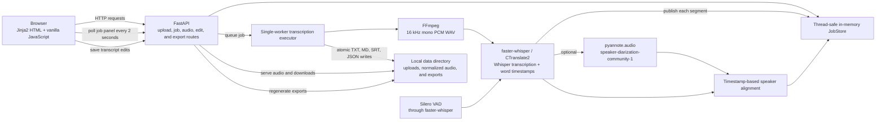

# audio2text

Local-first transcription workspace for audio conversations.

## Run

```bash
uv sync
uv run audio2text
```

Then open http://127.0.0.1:8000.

## Notes

- Transcription uses `faster-whisper` locally.
- Optional speaker diarization uses `pyannote.audio`.
- Audio is stored under `data/uploads`.
- Transcript exports are generated under `data/outputs`.
- If `ffmpeg` is available, uploads are normalized to 16 kHz mono WAV before transcription.

## Architecture

`audio2text` is a local, server-rendered FastAPI application. The browser owns playback and editing interactions; the Python process owns job state, model inference, speaker alignment, and export generation.



### Processing pipeline

1. FastAPI streams the upload to `data/uploads`, creates a `Job`, and submits it to a `ThreadPoolExecutor` with one worker. Jobs therefore run sequentially and do not compete for model memory.
2. When `ffmpeg` is installed, the worker normalizes the source to 16 kHz, mono, 16-bit PCM WAV under `data/outputs`. Without `ffmpeg`, the original upload is passed to the transcription library.
3. `faster-whisper` loads the selected Whisper model and yields timestamped segments. Each segment is copied into the thread-safe `JobStore` immediately so the polling job panel can render progressive output.
4. If diarization is enabled, preliminary exports are written as soon as transcription finishes. The pyannote pipeline then detects speaker turns while the transcript remains readable and downloadable.
5. Speaker turns are aligned to Whisper word timestamps by time overlap. Speaker changes can split a Whisper segment, and adjacent segments from the same speaker are merged when they are separated by less than one second.
6. Final TXT, Markdown, SRT, and JSON exports are written through temporary files and atomically replaced. Successful editor operations use the same export path, so downloads always reflect saved edits.

The job page is rendered with Jinja2 and enhanced with vanilla JavaScript. It polls a cache-disabled HTML fragment every two seconds, updates stage elapsed time locally every second, synchronizes transcript highlighting with the HTML audio player, and calls JSON edit endpoints for text, speaker, split, merge, and replace operations.

### Models and inference components

| Purpose | Model or runtime | Configuration in this app |
| --- | --- | --- |
| Speech-to-text | OpenAI Whisper models executed by `faster-whisper` on the CTranslate2 runtime | `tiny`, `base`, `small`, `medium` (default), or `large-v3`; English or automatic language detection; `int8` (default), `float16`, or `float32` compute |
| Voice activity detection | Silero VAD integrated into `faster-whisper` | Enabled by default through `vad_filter`; it suppresses non-speech regions before/during transcription |
| Word timing | Whisper word timestamps from `faster-whisper` | Optional in the UI and automatically enabled when speaker diarization is selected |
| Speaker diarization | `pyannote/speaker-diarization-community-1` through `pyannote.audio` | Enabled by default; requires an accepted Hugging Face model license and `HF_TOKEN`; supports exact, minimum, or maximum speaker-count constraints |
| Speaker-to-text synchronization | Deterministic timestamp-overlap logic in `app/transcription.py` | Uses word spans when available and segment spans as a fallback; this step does not use another ML model |

Model inference runs locally after the required model artifacts have been downloaded and cached by the underlying libraries. The Hugging Face token is used to retrieve the gated pyannote pipeline; audio is not sent to an application-owned remote service.

### Runtime state and storage

- `JobStore` keeps status, progress, segments, diarization turns, and edits in process memory behind a lock.
- `data/uploads` contains the original uploaded files.
- `data/outputs` contains normalized WAV audio and generated `.txt`, `.md`, `.srt`, and `.json` files.
- Restarting the server clears the in-memory job list and editor state. Existing uploads and exports remain on disk, but they are not currently rehydrated into the UI.
- The one-worker executor protects local CPU/GPU and memory usage, but queued jobs must wait for the active job to finish.

## Progress and logs

The job page refreshes every two seconds and publishes each segment as soon as faster-whisper yields it. The status panel shows when the current stage started and how long it has been running.

Terminal logs include timestamps, job IDs, stage durations, segment counts, audio progress, export writes, and one-minute heartbeats during long model-loading or diarization operations. When diarization is enabled, the raw transcript and preliminary exports become available before speaker assignment finishes.

## Transcript editor

Completed jobs include an audio-synchronized transcript workspace:

- Click a timestamp to seek and play from that segment.
- Follow playback to highlight the active segment automatically.
- Edit one or many segments, then save individually or with **Save all edits**.
- Place the text cursor inside a segment to split it at that point.
- Merge neighboring segments when their speaker labels match.
- Find text, jump between matches, and replace all occurrences.
- Rename a speaker everywhere in the transcript.

Every saved edit regenerates the TXT, Markdown, SRT, and JSON exports. Press `Ctrl+Enter` or `Cmd+Enter` while editing a segment to save it quickly.

## Speaker diarization

Diarization labels who spoke when, using generic labels such as `SPEAKER_00`.

To enable it:

1. Accept access to `pyannote/speaker-diarization-community-1` on Hugging Face.
2. Create a Hugging Face token with model read access.
3. Set the token before starting the app:

```bash
export HF_TOKEN=your_token_here
uv run audio2text
```

Or copy `.env.example` to `.env` and fill in `HF_TOKEN`.

When diarization is selected, the app automatically enables word timestamps so speakers can be merged into the transcript more accurately.

## Tests

```bash
uv run python -m unittest discover -v
```
